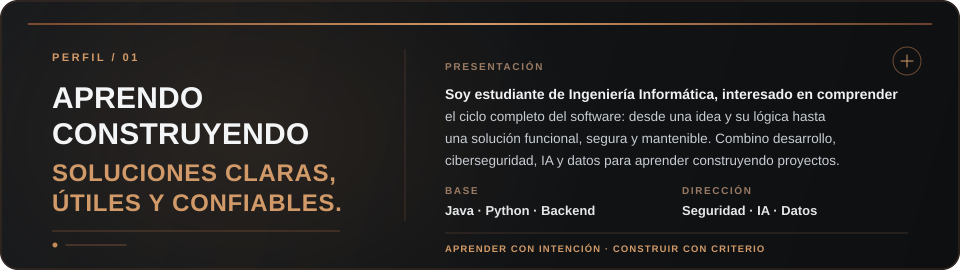
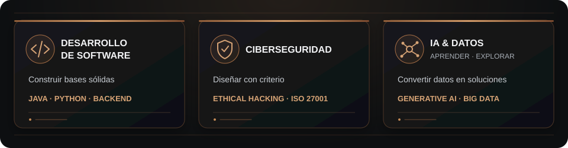

  

<h1 align="center">Hola, soy Jean Pierre Valenzuela</h1>

  

  
  

## Sobre mí

  

## En qué estoy trabajando

  

## Tecnologías y herramientas

  <strong>Base de desarrollo</strong>  
  
  
  
  
  

  <strong>Construcción y flujo de trabajo</strong>  
  
  
  
  
  

  
<strong>Certificaciones verificadas</strong>

   

- **Seguridad:** CAPC · CSFPC™ · CEHPC™ · ISO 27001 Foundation
- **Inteligencia artificial y datos:** CAIPC® · GAIPC™ · BDPC™
- **Desarrollo y agilidad:** Python Essentials 1 · SMPC® · Lifelong Learning 2026

  

## Actividad en GitHub

  
  

---

  <em>Aprender · Construir · Proteger · Mejorar</em>

